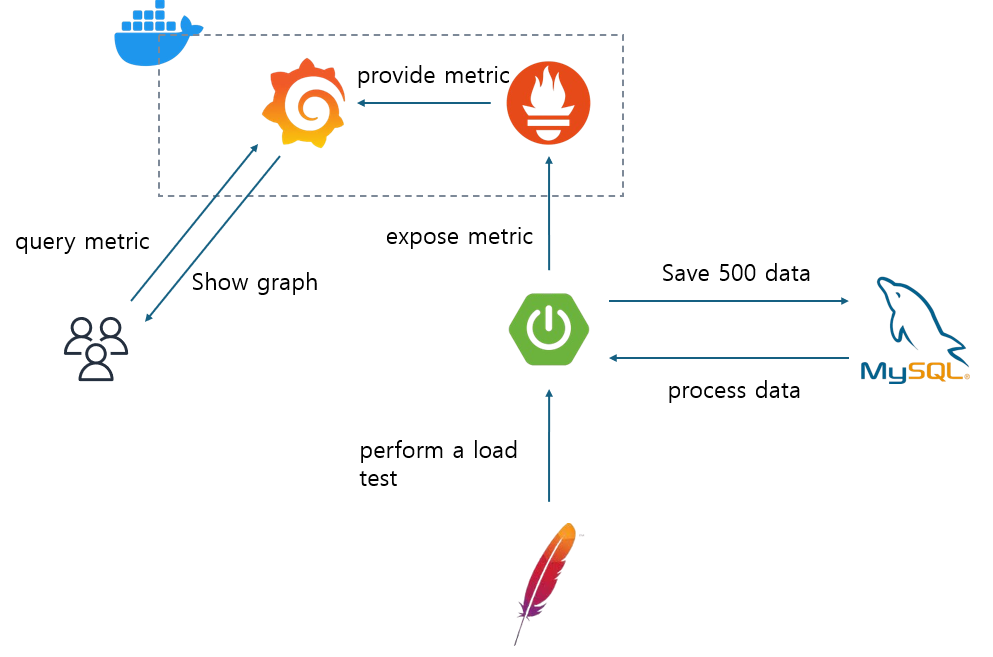

# spring_multithread_test

spring에서 스레드풀 관련 파라미터를 바꿔가며  
특정 알고리즘을 수행하는 API의 메트릭을  
Jmeter로 부하테스트를 가하며 측정합니다.

---

### 실험 보고서
(velog에 작성해서 올릴 예정)

---

### 실험 설계

##### 실험한 API의 알고리즘
https://www.acmicpc.net/problem/1431

##### API 명세서

| **엔드포인트** | **HTTP 메서드** | **설명** |
|----------------|------------------|-----------|
| `/test`        | GET              | DB에 있는 데이터를 불러와 알고리즘을 수행합니다. |
| `/delete`      | DELETE           | DB의 모든 데이터를 삭제합니다. |
| `/random`      | POST             | 500개의 무작위 문자열 데이터를 생성하여 DB에 저장합니다. |

##### 구조

